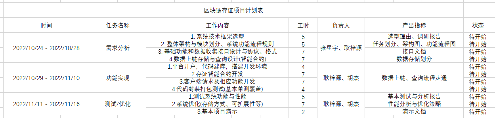
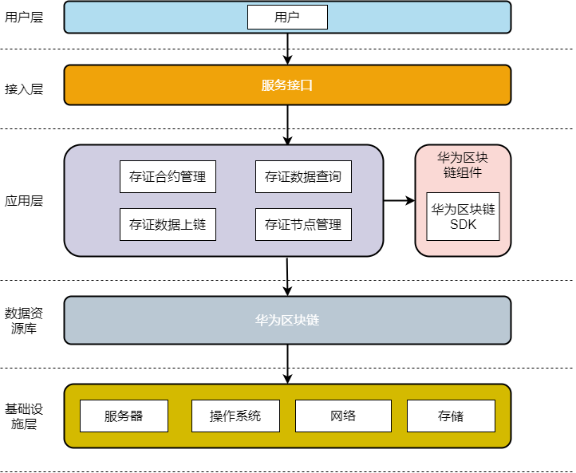
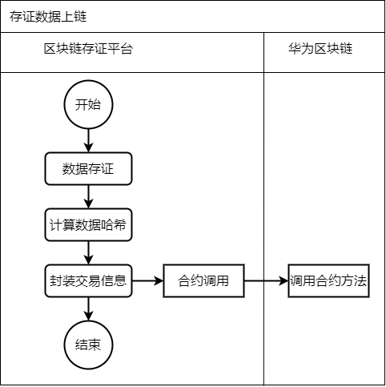
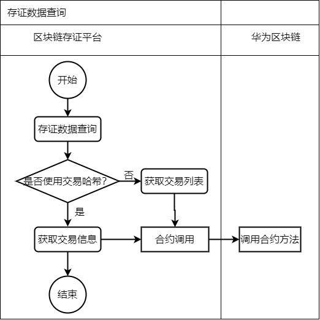

[TOC]

<h1>
    Blockchain Depository Project
</h1>

# 工作计划

# 需求分析

## 需求描述

区块链存证主要提供两个方面的服务：1.数据上链存储；2.根据手机号或交易哈希查询信息。

数据上链存储方面的需求描述如下：开发接口收集数据，并进行权限验证。将收集到的数据通过智能合约上链，并返回相应信息，如：交易凭证。

数据查询方面的需求描述如下：1.传入手机号进行查询，返回最近3条交易信息； 2.传入交易哈希，返回精准交易信息。

## 系统架构

## 功能模块

根据需求描述，本项目主要分两部分功能模块：1.区块链部分；2.后端部分。

一、区块链部分功能模块：

<ul>
    <li>1.数据上链:三类信息：商品信息、保税港信息、电商订单信息(加密上链)</li>
    <li>2.数据查询:手机号查询，交易哈希查询</li>
    <li>3.优化：待定(复合索引，关键字待定)</li>
</ul>

二、后端部分功能模块

<ul>
    <li>1.后端与区块链交互：1.消息封装；2.消息发送；3.消息解析等</li>
    <li>2.数据收集与通信：1.数据收集接口；2.区块链信息返回</li>
    <li>3.权限验证：对接口进行安全校验</li>
</ul>

## 功能流程

一、数据上链总体流程

<ul>
    <li>1.收集数据</li>
    <li>2.封装交易信息</li>
    <li>3.执行交易(存证信息上链)，返回相应信息</li>
</ul>

二、数据查询总体流程

<ul>
    <li>1.传入手机号/交易哈希</li>
    <li>2.解析区块链查询信息，返回相应信息</li>
</ul>

